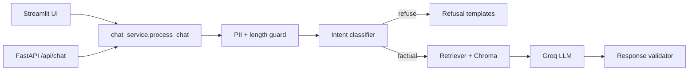

# Mutual Fund FAQ Assistant

Facts-only RAG assistant for five HDFC mutual fund schemes on Groww. Answers factual questions (expense ratio, exit load, minimum SIP, tax, holdings) with a single source citation. Refuses investment advice, comparisons, and performance calculations.

> **Facts-only. No investment advice.**

## Supported schemes (HDFC)

| Scheme | Category | Groww page |
|--------|----------|------------|
| HDFC Large Cap Fund Direct Growth | Large-cap equity | [groww.in/.../hdfc-large-cap-fund-direct-growth](https://groww.in/mutual-funds/hdfc-large-cap-fund-direct-growth) |
| HDFC Mid Cap Fund Direct Growth | Mid-cap equity | [groww.in/.../hdfc-mid-cap-fund-direct-growth](https://groww.in/mutual-funds/hdfc-mid-cap-fund-direct-growth) |
| HDFC Small Cap Fund Direct Growth | Small-cap equity | [groww.in/.../hdfc-small-cap-fund-direct-growth](https://groww.in/mutual-funds/hdfc-small-cap-fund-direct-growth) |
| HDFC Gold ETF Fund of Fund Direct Plan Growth | Gold ETF FOF | [groww.in/.../hdfc-gold-etf-fund-of-fund-direct-plan-growth](https://groww.in/mutual-funds/hdfc-gold-etf-fund-of-fund-direct-plan-growth) |
| HDFC Silver ETF FOF Direct Growth | Silver ETF FOF | [groww.in/.../hdfc-silver-etf-fof-direct-growth](https://groww.in/mutual-funds/hdfc-silver-etf-fof-direct-growth) |

## Architecture (high level)



1. **Corpus pipeline** — fetch five Groww URLs → parse → chunk → embed (`BAAI/bge-small-en-v1.5`) → Chroma.
2. **Retrieval** — scheme detection, section-type boost, cosine search (`TOP_K=5`, threshold `0.65`).
3. **Safety** — classify advisory/comparative/performance/out-of-scope before retrieval; validate answers after generation.
4. **UI** — Streamlit chat with disclaimer, examples, and session-only history.

See [docs/Architecture.md](docs/Architecture.md) and [docs/ImplementationPlan.md](docs/ImplementationPlan.md) for full design.

## Quick start

### 1. Clone and install

```bash
python -m venv .venv
source .venv/bin/activate          # Windows: .venv\Scripts\activate
pip install -r requirements.txt
cp .env.example .env               # add your GROQ_API_KEY
```

### 2. Build the corpus (first time)

```bash
# Full fetch + index (needs network)
python scripts/build_corpus.py

# Or re-index from existing raw HTML snapshots
python scripts/build_corpus.py --skip-fetch
```

Outputs:

- `data/raw/<scheme_slug>/` — HTML snapshots
- `data/processed/chunks.jsonl` — ~62 indexed chunks
- `data/chroma/` — vector index

### 3. Run the UI

```bash
streamlit run ui/streamlit_app.py
```

Open **http://localhost:8501**

### 4. Run the API (optional)

```bash
uvicorn src.api.main:app --reload
```

- API docs: http://localhost:8000/docs  
- Health: `GET /api/health`  
- Chat: `POST /api/chat` with `{"message": "..."}`  

## Environment variables

| Variable | Default | Purpose |
|----------|---------|---------|
| `GROQ_API_KEY` | *(empty)* | Groq API key for answer generation |
| `LLM_MODEL` | `llama-3.3-70b-versatile` | Groq chat model |
| `EMBEDDING_MODEL` | `BAAI/bge-small-en-v1.5` | Local embedding model |
| `VECTOR_DB_PATH` | `./data/chroma` | Chroma persistence directory |
| `TOP_K` | `5` | Retrieval top-k |
| `SIMILARITY_THRESHOLD` | `0.65` | Minimum cosine similarity for confident retrieval |
| `LLM_TEMPERATURE` | `0.1` | Generation temperature |
| `LLM_MAX_TOKENS` | `256` | Max completion tokens |

See [.env.example](.env.example) for the full list.

## Corpus refresh

| Task | Command |
|------|---------|
| Re-fetch all five Groww pages and rebuild | `python scripts/build_corpus.py` |
| Re-embed existing `chunks.jsonl` only | `python scripts/rebuild_index.py` |
| Skip network fetch (use latest raw HTML) | `python scripts/build_corpus.py --skip-fetch` |

Each successful `build_corpus.py` run writes `data/processed/last_ingest.json` with timestamps, chunk count, and status. `GET /api/health` exposes `last_ingest_at`, `ingest_stale` (>36h since last success), and `ingest_status`.

After a local refresh, restart Streamlit/API to pick up the new index.

### Daily ingest (GitHub Actions)

The **Daily corpus ingest** workflow (`.github/workflows/ingest-daily.yml`) rebuilds the corpus on a schedule:

| Trigger | When |
|---------|------|
| `schedule` | Daily at **10:30 IST** (`0 5 * * *` UTC) |
| `workflow_dispatch` | Manual run from **Actions → Daily corpus ingest → Run workflow** |

The job runs `python scripts/build_corpus.py`, then uploads `data/chroma/` and `data/processed/` as artifacts (90-day retention). A concurrency group (`ingest-daily`) prevents overlapping runs.

**Production:** Download the latest workflow artifact (or add a deploy step) and sync `data/chroma/` to the API host’s `VECTOR_DB_PATH`. Failed workflow runs do not replace the production index until a successful deploy.

```bash
# Example: apply a downloaded artifact to local data/
unzip corpus-<run_id>.zip -d data/
```

## Evaluation

Eight sample queries live in `tests/fixtures/sample_queries.json` (factual, advisory, comparative, performance, out-of-scope, PII).

```bash
# Safety/refusal queries only (no index required)
python scripts/run_eval.py --skip-factual

# Full eval (requires built index + GROQ_API_KEY for best factual answers)
python scripts/run_eval.py

# Pytest
pytest tests/test_eval_queries.py -m "not integration"   # safety path
pytest -m integration                                   # full stack
```

## Docker (optional)

```bash
docker compose up --build
```

- **UI:** http://localhost:8501  
- **API:** http://localhost:8000  

Mount `data/` as a volume so the Chroma index persists. Build the corpus on the host before first run, or exec into the container and run `build_corpus.py`.

## Known limitations

1. **Groww-only corpus** — Only five HDFC scheme pages are indexed; other funds are refused.
2. **HTML coverage** — If a field (e.g. benchmark) is missing from the parsed Groww page, the assistant cannot answer it confidently.
3. **JS-rendered pages** — Sparse HTML may require Playwright (`pip install playwright && playwright install chromium`); enabled by default in the fetcher.
4. **No real-time NAV or performance** — Return/CAGR questions get a Groww link only, no calculations.
5. **English only** — No multilingual retrieval in v1.
6. **No personalization** — No portfolio or risk profiling (by design).
7. **Groq free tier** — Rate limits apply; see `.env.example` comments.

## Manual QA

See [docs/QA_CHECKLIST.md](docs/QA_CHECKLIST.md) for a sign-off checklist aligned with the problem statement.

## Project layout

```
MF_RAG/
├── .github/workflows/
│   └── ingest-daily.yml     # scheduled corpus rebuild
├── data/urls.json           # five Groww URLs
├── docs/                    # architecture, implementation plan, QA
├── scripts/
│   ├── build_corpus.py
│   ├── rebuild_index.py
│   └── run_eval.py
├── src/
│   ├── api/                 # FastAPI + shared chat_service
│   ├── ingest/              # fetch, parse, chunk, pipeline
│   ├── index/               # embed + Chroma
│   └── rag/                 # guard, classifier, retriever, generator, validator
├── tests/
├── ui/streamlit_app.py      # Streamlit chat UI
├── requirements.txt
└── docker-compose.yml
```

## License / disclaimer

This is an educational demo. **Facts-only. No investment advice.** Not affiliated with HDFC AMC, Groww, or AMFI. Verify all figures on the official scheme pages before making decisions.
