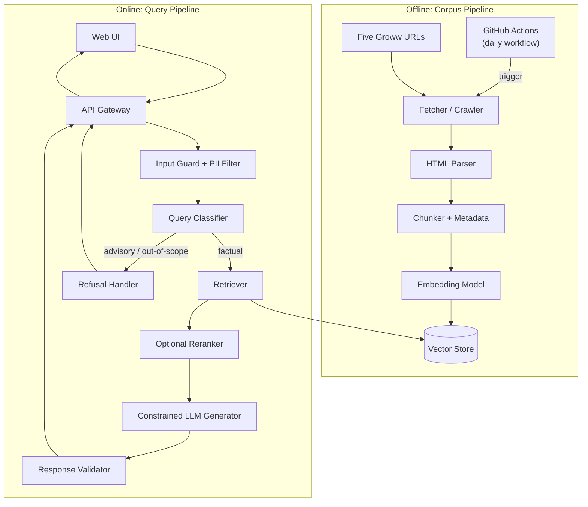
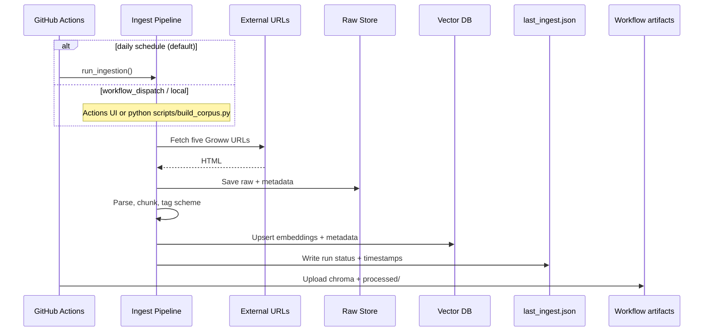
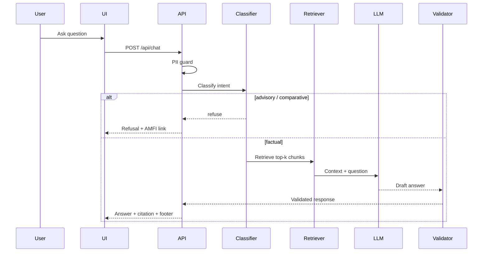

# Architecture: Mutual Fund FAQ Assistant (Facts-Only RAG)

This document describes the technical architecture for a lightweight, compliance-oriented RAG assistant scoped to five HDFC mutual fund schemes. It is derived from [problemStatement.md](./problemStatement.md).

---

## 1. Design Principles

| Principle | Implication |
|-----------|-------------|
| **Accuracy over intelligence** | Prefer retrieved facts over model creativity; constrain generation tightly. |
| **Facts-only** | No advice, opinions, comparisons, or return calculations. |
| **Source-backed** | Every answer cites exactly one URL and includes a last-updated footer. |
| **Minimal surface area** | Small corpus, simple UI, no user accounts or PII handling. |
| **Fail safe** | When uncertain or out-of-scope, refuse politely with an educational link. |

---

## 2. High-Level Architecture



The system splits into two paths:

1. **Offline corpus pipeline** — Ingests, chunks, embeds, and indexes documents on demand or on a **daily GitHub Actions schedule** (`ingest-daily.yml`).
2. **Online query pipeline** — Classifies the question, retrieves relevant chunks, generates a bounded answer, and validates output before returning it to the user.

---

## 3. System Components

### 3.1 Corpus Ingestion Layer

**Purpose:** Build a searchable knowledge base exclusively from the five provided Groww scheme pages. No PDFs, AMC factsheets, KIM/SID documents, or other external sources are ingested.

**External sources (complete list):**

| Scheme | Groww URL |
|--------|-----------|
| HDFC Large Cap Fund Direct Growth | https://groww.in/mutual-funds/hdfc-large-cap-fund-direct-growth |
| HDFC Mid Cap Fund Direct Growth | https://groww.in/mutual-funds/hdfc-mid-cap-fund-direct-growth |
| HDFC Small Cap Fund Direct Growth | https://groww.in/mutual-funds/hdfc-small-cap-fund-direct-growth |
| HDFC Gold ETF Fund of Fund Direct Plan Growth | https://groww.in/mutual-funds/hdfc-gold-etf-fund-of-fund-direct-plan-growth |
| HDFC Silver ETF FOF Direct Growth | https://groww.in/mutual-funds/hdfc-silver-etf-fof-direct-growth |

**Fetcher responsibilities:**

- HTTP fetch with retries, rate limiting, and respectful crawling (`robots.txt`, delays).
- Fetch **only** the five URLs above — no link discovery or follow-on crawling.
- Store raw HTML snapshots under versioned paths for reproducibility and audit.
- Record per-document metadata: `url`, `scheme_name`, `fetched_at`, `content_hash`.

**Parser responsibilities:**

- HTML → clean text (strip nav, ads, scripts).
- Normalize whitespace and tables where scheme attributes (expense ratio, exit load, minimum SIP) appear.
- No PDF parsing; the corpus is HTML-only.

**Citation policy:**

Every answer cites the Groww `source_url` of the scheme page from which the retrieved chunk originated.

---

### 3.2 Document Processing & Chunking

**Purpose:** Split documents into retrieval-friendly units while preserving scheme context.

**Chunking strategy:**

| Parameter | Recommended value | Rationale |
|-----------|-------------------|-----------|
| Chunk size | 400–600 tokens | Scheme facts are dense; smaller chunks improve precision. |
| Overlap | 50–80 tokens | Preserves context across table rows and bullet lists. |
| Split boundary | Headings first, then paragraphs | Keeps “Exit load” / “Expense ratio” sections intact. |

**Per-chunk metadata (stored alongside embedding):**

```json
{
  "chunk_id": "uuid",
  "scheme": "HDFC Large Cap Fund Direct Growth",
  "category": "large-cap equity",
  "source_url": "https://...",
  "doc_type": "scheme_page",
  "section_title": "Expense Ratio",
  "fetched_at": "2026-07-01T00:00:00Z",
  "text": "..."
}
```

**Scheme-aware tagging:** At ingest time, tag every chunk with one of the five scheme names so retrieval can filter when the user names a specific fund.

---

### 3.3 Embedding & Vector Store

**Purpose:** Enable semantic search over the corpus.

**Embedding model:** [BGE](https://huggingface.co/BAAI) (Beijing Academy of Artificial Intelligence), loaded locally via `sentence-transformers`:

- **Default:** `BAAI/bge-small-en-v1.5` — fast, strong retrieval baseline for English
- **Higher quality (optional):** `BAAI/bge-base-en-v1.5` — better accuracy, slightly slower

BGE models are open-source and run on CPU; no embedding API key is required.

**BGE encoding convention:** Prefix queries with `query: ` and document chunks with `passage: ` when generating embeddings (required for optimal retrieval with BGE).

**Vector store (lightweight options):**

| Option | When to use |
|--------|-------------|
| **Chroma** (embedded, file-based) | Simplest local dev and demo |
| **FAISS** (in-process index) | Minimal dependencies, read-heavy |
| **Qdrant / Pinecone** | If cloud deployment or larger corpus later |

**Index schema:** One collection `hdfc_mf_corpus` with metadata filters on `scheme`, `doc_type`, and `source_url`.

---

### 3.4 Query Pipeline

#### Step 1: Input Guard

- Reject or redact patterns matching PII: PAN, Aadhaar, account numbers, OTPs, email, phone.
- Enforce max query length (e.g., 500 characters).
- Log only anonymized query hashes if logging is enabled (no raw PII).

#### Step 2: Query Classifier

Routes each question before retrieval.

| Class | Examples | Action |
|-------|----------|--------|
| **Factual** | “What is the expense ratio of HDFC Mid Cap Fund?” | Proceed to RAG |
| **Advisory** | “Should I invest in this fund?” | Refusal handler |
| **Comparative** | “Which fund is better?” | Refusal handler |
| **Performance** | “What returns did it give last year?” | Link to the relevant Groww scheme page only (no calculated returns) |
| **Out-of-scope** | Unrelated or unknown scheme | Polite refusal + educational link |

**Implementation options:**

- **Rules + keywords** (fast, deterministic): patterns like `should I`, `better`, `recommend`, `vs`, `compare`.
- **Small LLM classifier** (optional): single-shot JSON via Groq for edge cases — `{ "intent": "factual" | "advisory" | ... }`

Classifier runs **before** retrieval to avoid retrieving content that could bias an advisory answer.

#### Step 3: Retriever

1. Embed the user query.
2. Vector similarity search with `top_k = 5` (tunable).
3. Optional metadata filter if scheme is detected in the query (NER or keyword match on scheme names).
4. Optional **reranker** (cross-encoder) on top 10 → best 3 for generation.

**Retrieval quality checks:**

- Minimum similarity threshold; below threshold → “I don’t have enough verified information” refusal.
- Deduplicate chunks from the same `source_url`.

#### Step 4: Constrained Generator

LLM receives:

- System prompt: facts-only, max 3 sentences, one citation, no advice, no performance math.
- Retrieved chunks (with URLs and dates).
- User question.

**Generation constraints (enforced in prompt + post-processing):**

- Maximum 3 sentences in the answer body.
- Exactly one markdown or plain URL in the response.
- Append footer: `Last updated from sources: <date>` using the newest `fetched_at` among cited chunks.

**LLM provider:** [Groq](https://groq.com/) — fast hosted inference for open models via the Groq API.

- **Default model:** `llama-3.3-70b-versatile` (or `llama-3.1-8b-instant` for lower latency)
- **SDK:** `groq` Python client
- **Auth:** `GROQ_API_KEY` environment variable
- Temperature kept low (0–0.2) to reduce hallucination

#### Step 5: Response Validator

Programmatic checks before returning:

| Check | Failure action |
|-------|----------------|
| Sentence count ≤ 3 | Truncate or regenerate |
| Exactly one URL present | Regenerate or attach best `source_url` from top chunk |
| No advisory phrases | Replace with refusal template |
| No return/CAGR calculations | Strip and point to the Groww scheme page |
| Footer present | Append if missing |

---

### 3.5 Refusal Handler

Returns a fixed-structure message without calling the generator:

```
I'm a facts-only assistant and can't provide investment advice or comparisons.

For general mutual fund education, see: https://www.amfiindia.com/investor/knowledge-center-info
```

- Tone: polite, explicit about limitation.
- Include one educational link (AMFI or SEBI) in refusal responses only — these are **not** ingested into the corpus.
- Do not retrieve scheme-specific chunks for advisory queries.

---

### 3.6 API Layer

**Suggested endpoints:**

| Method | Path | Description |
|--------|------|-------------|
| `POST` | `/api/chat` | `{ "message": "..." }` → `{ "answer", "source_url", "last_updated", "disclaimer" }` |
| `GET` | `/api/health` | Liveness / index loaded |
| `GET` | `/api/schemes` | List of five supported schemes (for UI) |

**Response contract:**

```json
{
  "answer": "The expense ratio for HDFC Mid Cap Fund Direct Growth is 0.76% as per the latest available disclosure.",
  "source_url": "https://groww.in/mutual-funds/hdfc-mid-cap-fund-direct-growth",
  "last_updated": "2026-07-01",
  "disclaimer": "Facts-only. No investment advice.",
  "refused": false
}
```

---

### 3.7 User Interface

Minimal chat UI built with **Streamlit** (`ui/streamlit_app.py`).

**Run:** `streamlit run ui/streamlit_app.py` → `http://localhost:8501`

The UI calls `process_chat()` in `src/api/chat_service.py` directly (same pipeline as `POST /api/chat`). FastAPI remains available for programmatic access and integration tests.

**Required elements (per problem statement):**

- Welcome message explaining facts-only scope and HDFC scheme coverage.
- Three example questions (clickable), e.g.:
  - “What is the minimum SIP for HDFC Large Cap Fund?”
  - “What is the exit load on HDFC Small Cap Fund?”
  - “What is the benchmark for HDFC Mid Cap Fund?”
- Persistent disclaimer: **Facts-only. No investment advice.**
- Chat input + message history (session-only via `st.session_state`; no persistence).
- Render answer, single source link (`st.link_button`), and last-updated footer (`st.caption`).
- Distinct refusal styling for advisory / comparative / out-of-scope responses.

**Stack:**

- **Frontend:** Streamlit (Python)
- **Backend:** FastAPI for REST API; shared `chat_service.py` for pipeline logic

No login, no forms collecting PII.

---

### 3.8 Scheduler Component (GitHub Actions)

**Purpose:** Automatically trigger the corpus ingestion pipeline on a fixed schedule so the vector index and `last_updated` footers reflect the latest Groww page content — without a long-lived scheduler process or server cron.

**Workflow:** `.github/workflows/ingest-daily.yml`

**Responsibilities:**

- Run on a **daily schedule** (default `0 5 * * *` UTC = 10:30 `Asia/Kolkata`) calling `run_ingestion()` from `src/ingest/pipeline.py` (same path as `scripts/build_corpus.py`).
- Support **manual re-runs** via `workflow_dispatch` from the GitHub Actions UI.
- **Concurrency guard** — `concurrency: group: ingest-daily, cancel-in-progress: false` so overlapping scheduled/manual jobs do not run in parallel.
- **Run manifest** — after each attempt, write `data/processed/last_ingest.json` with timestamps, chunk count, duration, `workflow_run_id`, and success/failure status.
- **Publish index** — upload `data/chroma/` and `data/processed/` as workflow artifacts; optional deploy job syncs to production storage (S3, VPS volume, etc.).
- **Failure isolation** — failed workflow jobs do not deploy a partial index; production retains the last good artifact.

**Workflow configuration:**

| Setting | Value | Description |
|---------|-------|-------------|
| Schedule cron | `0 5 * * *` (UTC) | Daily at 10:30 IST (GitHub cron is always UTC) |
| Manual trigger | `workflow_dispatch` | On-demand ingest from Actions tab |
| Concurrency group | `ingest-daily` | Prevent parallel corpus builds |
| Artifact retention | 30–90 days | Persist Chroma index from ephemeral runner |

**CI job steps (summary):**

1. Checkout repository
2. Setup Python 3.11+; cache pip and Hugging Face model weights
3. `pip install -r requirements.txt`
4. `python scripts/build_corpus.py`
5. Upload `data/chroma/` and `data/processed/` as artifacts

**Relationship to ingestion:** The workflow does not duplicate fetch/parse/chunk logic. It invokes the same `run_ingestion()` entrypoint used by `scripts/build_corpus.py` for local and CI runs.

**Why GitHub Actions:** Built-in cron, run logs, failure notifications, and manual dispatch — no always-on scheduler container. Runners are ephemeral, so artifacts (and an optional deploy step) bridge the gap between CI and the API host that reads the Chroma index.

---

## 4. End-to-End Data Flows

### 4.1 Corpus Build (scheduled / on-demand)



### 4.2 User Query (online)



---

## 5. Recommended Project Structure

```
MF_RAG/
├── .github/
│   └── workflows/
│       └── ingest-daily.yml # Scheduled + manual corpus ingest
├── docs/
│   ├── problemStatement.md
│   └── Architecture.md
├── data/
│   ├── raw/                 # Fetched HTML snapshots (five Groww pages)
│   ├── processed/           # Parsed text / chunk JSONL
│   └── urls.json            # The five Groww scheme URLs
├── src/
│   ├── ingest/
│   │   ├── fetcher.py
│   │   ├── parser.py
│   │   ├── chunker.py
│   │   └── pipeline.py      # run_ingestion() — shared by build script + GHA workflow
│   ├── index/
│   │   ├── embedder.py
│   │   └── vector_store.py
│   ├── rag/
│   │   ├── classifier.py
│   │   ├── retriever.py
│   │   ├── generator.py
│   │   ├── validator.py
│   │   └── refusal.py
│   └── api/
│       ├── main.py          # FastAPI app
│       └── chat_service.py  # Shared chat pipeline
├── ui/                      # Streamlit frontend (streamlit_app.py)
├── scripts/
│   ├── build_corpus.py
│   └── rebuild_index.py
├── tests/
├── requirements.txt
└── README.md
```

---

## 6. Technology Stack (Suggested)

| Layer | Technology | Notes |
|-------|------------|-------|
| Language | Python 3.11+ | Strong RAG ecosystem |
| API | FastAPI + Uvicorn | Async, OpenAPI docs |
| Scraping | `httpx` + `beautifulsoup4` | HTML only (five Groww pages) |
| Embeddings | `sentence-transformers` + BGE (`BAAI/bge-small-en-v1.5`) | Local, CPU-friendly |
| Vector DB | Chroma or FAISS | File-based, no extra infra |
| LLM | Groq API (`groq` SDK) | Hosted; requires `GROQ_API_KEY` |
| UI | Streamlit | `streamlit run ui/streamlit_app.py` on port 8501 |
| Config | `.env` + `pydantic-settings` | API keys, model names |
| Scheduler | GitHub Actions (`ingest-daily.yml`) | Daily cron + manual dispatch for ingestion |

---

## 7. Security, Privacy & Compliance

| Requirement | Architectural control |
|-------------|----------------------|
| No PII collection | Stateless API; no DB of users; input regex guard |
| No account data | No auth module |
| Facts-only content | Classifier + validator + strict system prompt |
| Groww-only corpus | Citations always use the Groww scheme page `source_url` |
| Auditability | Versioned raw snapshots + chunk `source_url` + `fetched_at` |

**Logging:** Log intent class and retrieval IDs only; never log full user messages if they might contain PII.

---

## 8. Operational Concerns

### 8.1 Corpus Refresh

- **Frequency:** **Daily** via GitHub Actions (`ingest-daily.yml`, default 10:30 IST) or on-demand (`workflow_dispatch` / local `build_corpus.py`).
- **Process:** Workflow runs `run_ingestion()` → fetch five URLs → re-chunk → re-embed → upsert Chroma → upload artifacts.
- **Concurrency:** Workflow concurrency group prevents parallel builds; failed runs retain the previous production index.
- **Observability:** `data/processed/last_ingest.json` in artifacts; optional `last_ingest_at` on `/api/health`.
- **Stale answers:** Footer `last_updated` reflects newest `fetched_at` in cited chunks.

### 8.2 Configuration

Environment variables (example):

```
GROQ_API_KEY=your_groq_api_key
LLM_MODEL=llama-3.3-70b-versatile
EMBEDDING_MODEL=BAAI/bge-small-en-v1.5
VECTOR_DB_PATH=./data/chroma
TOP_K=5
SIMILARITY_THRESHOLD=0.65
```

### 8.3 Deployment (minimal)

- **API / UI:** Single container or `docker compose` with mounted `data/` volume for the Chroma index.
- **Ingestion:** GitHub Actions workflow builds the index on a schedule; production loads the latest artifact (pull, S3 sync, or deploy job to the API host).
- No GPU required: Groq hosts the LLM; BGE embeddings run on CPU (CI runner or API host).
- Health check on `/api/health` verifies index is loaded (and optionally ingest freshness).

---

## 9. Supported Schemes (Corpus Scope)

The corpus contains **only** the five Groww pages below. No other URLs are indexed.

| Scheme | Category | Corpus URL |
|--------|----------|------------|
| HDFC Large Cap Fund Direct Growth | Large-cap equity | https://groww.in/mutual-funds/hdfc-large-cap-fund-direct-growth |
| HDFC Mid Cap Fund Direct Growth | Mid-cap equity | https://groww.in/mutual-funds/hdfc-mid-cap-fund-direct-growth |
| HDFC Small Cap Fund Direct Growth | Small-cap equity | https://groww.in/mutual-funds/hdfc-small-cap-fund-direct-growth |
| HDFC Gold ETF Fund of Fund Direct Plan Growth | Gold ETF FOF | https://groww.in/mutual-funds/hdfc-gold-etf-fund-of-fund-direct-plan-growth |
| HDFC Silver ETF FOF Direct Growth | Silver ETF FOF | https://groww.in/mutual-funds/hdfc-silver-etf-fof-direct-growth |

Queries about other funds should be refused or answered with “outside supported corpus” messaging.

---

## 10. Known Limitations

1. **Corpus coverage** — Limited to the five Groww pages; missing fields on a page cannot be answered confidently.
2. **Single source type** — No PDFs or AMC/AMFI/SEBI documents; all facts must come from Groww HTML content.
3. **Dynamic web content** — JavaScript-rendered Groww pages may need Playwright instead of simple HTTP fetch.
4. **No real-time NAV or performance** — Performance questions defer to the relevant Groww scheme page link only.
5. **English only** — No multilingual retrieval in v1.
6. **No personalization** — Cannot tailor to user portfolio or risk profile (by design).

---

## 11. Success Criteria Mapping

| Success criterion | Architectural mechanism |
|-------------------|-------------------------|
| Accurate factual retrieval | Scheme-tagged chunks + similarity threshold + reranking |
| Facts-only responses | Classifier + constrained prompt + validator |
| Valid citations | Single-URL enforcement; always the Groww `source_url` of the cited scheme |
| Advisory refusal | Pre-retrieval classifier + refusal handler |
| Clean minimal UI | Single-page chat with disclaimer and example prompts |

---

## 12. Implementation Phases

| Phase | Deliverable |
|-------|-------------|
| **Phase 1** | Ingest five seed URLs; chunk, embed, index locally |
| **Phase 2** | RAG API: retrieve + generate with citation footer |
| **Phase 3** | Classifier, refusal handler, response validator |
| **Phase 4** | Minimal UI with welcome, examples, disclaimer |
| **Phase 5** | Tune retrieval on Groww corpus; README |
| **Phase 6** | GitHub Actions: `ingest-daily.yml`, artifact publish, run manifest |

---

## Summary

The Mutual Fund FAQ Assistant is a **two-stage RAG system**: an offline ingestion pipeline builds a scheme-tagged vector index from **five Groww scheme pages only** (no PDFs or other external sources), refreshed **daily by a GitHub Actions workflow** or on demand; an online pipeline classifies queries, retrieves evidence, generates short cited answers, and validates output for compliance. The architecture prioritizes **traceability** (every answer links to one Groww source), **safety** (early refusal of advisory questions), and **simplicity** (no users, no PII, minimal UI)—matching the facts-only mandate in the problem statement.
