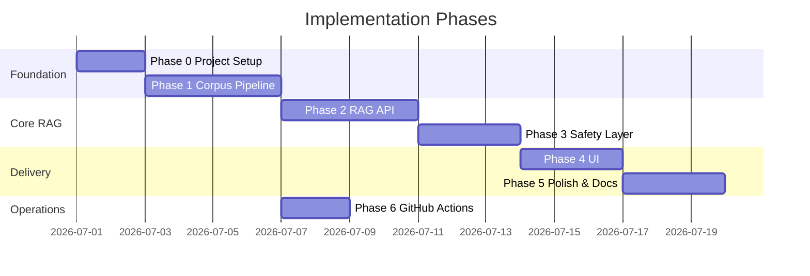
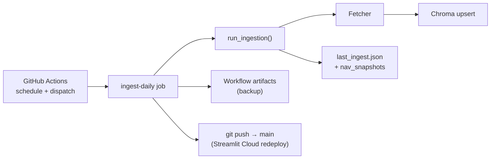
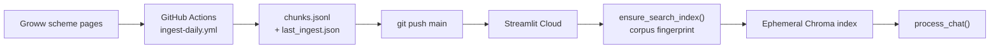
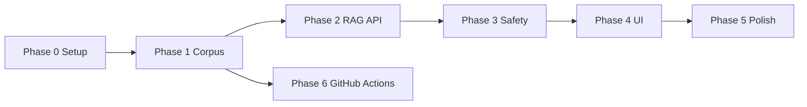

# Phase-Wise Implementation Plan

This document breaks down the build of the Mutual Fund FAQ Assistant into six phases, aligned with [Architecture.md](./Architecture.md) and [problemStatement.md](./problemStatement.md).

---

## Overview



| Phase | Focus | Outcome |
|-------|--------|---------|
| **0** | Project setup | Runnable repo skeleton, config, dependencies |
| **1** | Corpus pipeline | Indexed vector store from five Groww pages |
| **2** | RAG API | `/api/chat` returns cited factual answers |
| **3** | Safety layer | Classifier, refusals, validator, PII guard |
| **4** | UI | Minimal chat interface with disclaimer |
| **5** | Polish & docs | Tuned retrieval, tests, README, Streamlit Cloud deployment |
| **6** | Scheduler | GitHub Actions daily ingest → auto-commit corpus to git → Streamlit redeploy |

---

## Phase 0: Project Setup

**Goal:** Establish repository structure, dependencies, and configuration so later phases have a consistent foundation.

### Tasks

| # | Task | Details |
|---|------|---------|
| 0.1 | Initialize project layout | Create folders per Architecture §5: `src/`, `data/`, `scripts/`, `tests/`, `ui/` |
| 0.2 | Add `requirements.txt` | `fastapi`, `uvicorn`, `httpx`, `beautifulsoup4`, `chromadb` (or `faiss-cpu`), `sentence-transformers`, `pydantic-settings`, `python-dotenv`, `groq` |
| 0.3 | Add `data/urls.json` | Define all five Groww URLs with `scheme`, `category`, and `url` fields |
| 0.4 | Add `.env.example` | Document `GROQ_API_KEY`, `LLM_MODEL`, `EMBEDDING_MODEL`, `VECTOR_DB_PATH`, `TOP_K`, `SIMILARITY_THRESHOLD` |
| 0.5 | Add config module | `src/config.py` using `pydantic-settings` to load env vars |
| 0.6 | Add `.gitignore` | Ignore `.env`, `data/raw/`, `data/chroma/`, `__pycache__/`, virtualenv |

### Files to create

```
MF_RAG/
├── .env.example
├── .gitignore
├── requirements.txt
├── data/
│   └── urls.json
└── src/
    └── config.py
```

### Acceptance criteria

- [ ] `python -m venv .venv && pip install -r requirements.txt` succeeds
- [ ] `urls.json` contains exactly five Groww scheme entries
- [ ] Config loads from environment without hardcoded secrets

### Dependencies

- None (first phase)

---

## Phase 1: Corpus Pipeline

**Goal:** Fetch, parse, chunk, embed, and index content from the five Groww URLs into a local vector store.

**Architecture reference:** §3.1 (Ingestion), §3.2 (Chunking), §3.3 (Embedding & Vector Store), §4.1 (Corpus Build flow)

### Tasks

| # | Task | Details |
|---|------|---------|
| 1.1 | Implement fetcher | `src/ingest/fetcher.py` — HTTP GET with retries, rate limit, User-Agent; save HTML to `data/raw/<scheme_slug>/<timestamp>.html` |
| 1.2 | Handle JS-rendered pages | If `httpx` returns sparse HTML, add optional Playwright path in fetcher (Architecture §10 limitation #3) |
| 1.3 | Implement parser | `src/ingest/parser.py` — BeautifulSoup: strip scripts/nav; extract main content and tables; **extract latest NAV + date from Groww `__NEXT_DATA__` JSON** (`mfServerSideData.nav`, `nav_date`) |
| 1.4 | Implement chunker | `src/ingest/chunker.py` — Section-aware chunking from `ParsedDocument` (see **Chunking strategy** below); emit dedicated **`nav`** chunk per scheme when NAV is present; attach metadata schema from Architecture §3.2 |
| 1.5 | Scheme tagging | Map each URL to scheme name and category from `urls.json`; set `doc_type: "scheme_page"` on every chunk |
| 1.6 | Implement embedder | `src/index/embedder.py` — `BAAI/bge-small-en-v1.5` (see **Embedding strategy**); `passage: ` / `query: ` prefixes; L2-normalized 384-dim vectors |
| 1.7 | Implement vector store | `src/index/vector_store.py` — Chroma collection `hdfc_mf_corpus` with metadata filters |
| 1.8 | Build script | `scripts/build_corpus.py` — Orchestrate fetch → parse → chunk → embed → upsert; write `data/processed/chunks.jsonl` |
| 1.9 | Rebuild script | `scripts/rebuild_index.py` — Re-embed from existing `chunks.jsonl` without re-fetching |

### Chunking strategy

Derived from live parses of all five Groww pages (Phase 1.3 output, fetched 2026-07-01). The parser yields a `ParsedDocument` per scheme with **10–11 heading-based sections**, **3–4 tables**, a **Fund details** block (labeled facts: expense ratio, minimum SIP, exit load, etc.), and **latest NAV** from embedded page JSON. Parsed text per scheme is **5.9k–14.4k characters** (~1.5k–3.6k tokens).

#### NAV extraction (Groww `__NEXT_DATA__`)

Groww scheme pages do **not** expose NAV as a visible labeled DOM field in the static HTML shell, but each page embeds server-side fund data in Next.js `__NEXT_DATA__`:

| JSON path | Example | Stored as |
|-----------|---------|-----------|
| `props.pageProps.mfServerSideData.nav` | `226.765` | `ParsedDocument.nav_value` |
| `props.pageProps.mfServerSideData.nav_date` | `30-Jun-2026` | `ParsedDocument.nav_date` |

**Parser output:** `NAV ₹226.765 (as on 30-Jun-2026)` is prepended to the Fund details block and exposed on `ParsedDocument`.

**Chunker output:** one atomic chunk per scheme with `section_type: "nav"`, `section_title: "NAV"`, and the same NAV line in `text` (embedded for retrieval).

**Scope note:** This indexes the **latest NAV snapshot** from the Groww page at fetch time — not historical NAV series. Performance / NAV-history questions remain in the Phase 3 `performance` refusal path.

#### Observed structure (parser output)

| Section type | Typical size | FAQ value | Chunking action |
|--------------|-------------|-----------|-----------------|
| **NAV** (from `__NEXT_DATA__`) | ~40–60 chars | **High** — latest unit NAV | One atomic `nav` chunk per scheme; also prepend to Fund details |
| Fund details (labeled facts) | 200–800 chars | **High** — expense ratio, SIP, exit load | One chunk; split into atomic fact lines if block exceeds 600 tokens |
| Exit load | ~42 chars | **High** | Keep as single atomic chunk |
| Minimum investments | ~75 chars | **High** | Keep as single atomic chunk |
| Tax implication | ~150 chars | **High** | Keep as single atomic chunk |
| Investment objective | ~110 chars | **High** | Keep as single atomic chunk |
| Return calculator | ~265 chars | Medium | Keep as single chunk |
| Compare similar funds | ~355 chars | Medium | Keep as single chunk (equity schemes only) |
| Holdings | 150–4,250 chars | Medium — top-holdings queries | Keep atomic if ≤ 600 tokens; else split by table rows (~10 rows/chunk, repeat header) |
| Fund management (manager bios) | 2,500–3,500 chars | **Low** — not in scope for factual FAQ | **Exclude** from index |
| Understand terms / Stamp duty / Page header | 18–160 chars | **Low** — boilerplate | **Exclude** from index |

**Key insight:** 45 of 53 parsed sections already fit under 400 tokens. Only **holdings** (equity funds) and **fund management** exceed 600 tokens. Overlap is needed only when splitting oversized sections — not between discrete FAQ sections like “Exit load” and “Tax implication”.

#### Chunker input and boundaries

1. **Input:** `ParsedDocument` from `parser.py` — chunk from `sections`, `tables`, and the Fund details block. **Do not** re-split the flat `doc.text` string (it duplicates tables already embedded in sections).
2. **Primary boundary:** One parser section → one chunk when the section body is ≤ **600 tokens** (~2,400 characters).
3. **Context prefix:** Prepend `{scheme name} — {section_title}:` to every chunk `text` field before embedding so retrieval stays scheme-aware even without metadata filters.
4. **Sub-split rules** (only when a section exceeds 600 tokens):
   - **Table rows** (holdings, return tables): split on `\n` row boundaries; include the header row in each sub-chunk; target **8–12 data rows** per chunk.
   - **Prose** (rare): split on paragraph boundaries with **50–80 token overlap** (~200–320 characters).
5. **Standalone tables:** If a table appears in `ParsedDocument.tables` but not inside a section body, emit one chunk per table using the same size rules.
6. **Exclusions:** Skip sections whose title matches (case-insensitive): `Understand terms`, `Stamp duty`, and the page H1/header line. Skip `Fund management` entirely.

#### Parameters

| Parameter | Value | Rationale |
|-----------|-------|-----------|
| Max chunk size | **600 tokens** (~2,400 chars) | Matches Architecture §3.2 upper bound; 45/53 sections already fit without splitting |
| Min chunk size | **30 tokens** (~120 chars) | Avoid indexing near-empty header crumbs |
| Overlap | **50–80 tokens** | Apply **only** when sub-splitting oversized sections (holdings rows), not between sections |
| Target chunks per scheme | **9–18** | ~60–70 chunks total across five schemes (holdings row-splits + one `nav` chunk each) |
| `chunk_id` | Deterministic hash | `sha256(scheme + section_title + chunk_index)[:16]` for idempotent rebuilds |

#### Observed chunk inventory (built 2026-07-02, updated with NAV chunks)

Live output from `data/processed/chunks.jsonl` after Phase 1.8 (`build_corpus.py --skip-fetch`):

| Metric | Value |
|--------|-------|
| **Total chunks** | **67** (62 + 5 `nav`) |
| Token length (min / median / max) | 21 / 65 / 173 |
| Character length (min / median / max) | 87 / 262 / 694 |
| Chunks &lt; 30 tokens | 5 (all `exit_load`) |
| Chunks &gt; 400 tokens | 0 |
| Chunks &gt; 600 tokens | 0 |

| Scheme | Total | Breakdown (section_type counts) |
|--------|------:|--------------------------------|
| HDFC Large Cap Fund Direct Growth | 14 | core sections + **nav** + **5 holdings** |
| HDFC Mid Cap Fund Direct Growth | 17 | core sections + **nav** + **8 holdings** |
| HDFC Small Cap Fund Direct Growth | 18 | core sections + **nav** + **9 holdings** |
| HDFC Gold ETF FOF Direct Plan Growth | 9 | core sections + **nav** + 1 holdings (no compare_funds) |
| HDFC Silver ETF FOF Direct Growth | 9 | core sections + **nav** + 1 holdings (no compare_funds) |

| `section_type` | Count | Notes |
|----------------|------:|-------|
| `holdings` | 24 | 36% of corpus — row-split equity holdings tables |
| `fund_details` | 5 | One per scheme; includes NAV line in text when present |
| `nav` | 5 | One per scheme — latest NAV from Groww `__NEXT_DATA__` |
| `exit_load`, `minimum_investments`, `tax`, `investment_objective`, `returns` | 5 each | Short atomic FAQ chunks (~87–200 chars) |
| `table` | 5 | Standalone category-return tables |
| `compare_funds` | 3 | Large / Mid / Small Cap only |

**Delta from pre-build estimate:** Equity schemes produce more chunks than the original ~9–10/scheme table because holdings tables split into **5–9 row chunks** each (not 1–2). Gold and Silver ETF FOF stay at ~8/scheme as expected.

#### Query-type → chunk mapping (retrieval design)

| User question pattern | Expected top chunks |
|-----------------------|---------------------|
| “What is the expense ratio of HDFC Mid Cap?” | `fund_details`, `section_type=exit_load` (if ratio also in exit-load context) |
| “What is the latest NAV of HDFC Mid Cap?” | `nav`, `fund_details` |
| “Minimum SIP for HDFC Large Cap?” | `minimum_investments`, `fund_details` |
| “Exit load on HDFC Small Cap?” | `exit_load`, `fund_details` |
| “What is the investment objective?” | `investment_objective` |
| “Tax on HDFC Gold ETF FOF?” | `tax` |
| “Top holdings of HDFC Mid Cap?” | `holdings` (row-split chunks) |

### Chunk metadata contract

Each chunk in `chunks.jsonl` must include:

```json
{
  "chunk_id": "a1b2c3d4e5f67890",
  "scheme": "HDFC Large Cap Fund Direct Growth",
  "category": "large-cap equity",
  "source_url": "https://groww.in/mutual-funds/hdfc-large-cap-fund-direct-growth",
  "doc_type": "scheme_page",
  "section_title": "Exit load",
  "section_type": "exit_load",
  "chunk_index": 0,
  "fetched_at": "ISO-8601",
  "text": "HDFC Large Cap Fund Direct Growth — Exit load:\nExit load of 1% if redeemed within 1 year"
}
```

**`section_type` values:** `nav`, `fund_details`, `exit_load`, `minimum_investments`, `tax`, `investment_objective`, `returns`, `holdings`, `compare_funds`, `table` (for standalone table chunks).

**`chunk_index`:** 0 for unsplit sections; 0, 1, 2… for row-split holdings or oversized table sub-chunks.

### Embedding strategy

Derived from the **62 indexed chunks** (Phase 1.8 build) and smoke retrieval on `BAAI/bge-small-en-v1.5`.

#### Corpus characteristics relevant to embedding

| Property | Implication for model choice |
|----------|------------------------------|
| **Tiny corpus** (62 vectors) | Embedding quality differences between small and large BGE are minor; latency and simplicity matter more. |
| **Short chunks** (median ~65 tokens, max ~173) | Well within context limits of any BGE variant; no long-document modeling needed. |
| **Dense factual English** | Keyword-heavy labels (`Expense ratio`, `Exit load`, `Min. for 1st investment`) — small bi-encoders handle this well. |
| **High structural similarity across schemes** | Five pages share the same section layout; scheme names in chunk text are the main disambiguator. |
| **39% holdings chunks** | Semi-structured tables; retrieval often needs `section_type` + scheme metadata, not deeper semantics. |

#### Model recommendation

| Model | Dims | Verdict |
|-------|------|---------|
| **`BAAI/bge-small-en-v1.5`** (default) | 384 | **Use this.** Best fit for corpus size, chunk length, CPU-only demo, and current retrieval quality. |
| `BAAI/bge-base-en-v1.5` | 768 | Optional Phase 5 A/B only if eval shows paraphrase misses on bge-small. |
| `BAAI/bge-large-en-v1.5` | 1024 | **Not recommended** — marginal gain on 62 short chunks; ~3× slower encode and larger Chroma footprint. |

**Decision: stay on BGE-small.** The bottleneck for this corpus is **scheme disambiguation and section routing**, not embedding capacity. Smoke tests with bge-small (scheme filter on, `top_k=3`):

| Query | Top `section_type` | Similarity |
|-------|-------------------|------------|
| expense ratio HDFC Mid Cap | `fund_details` | 0.84 |
| minimum SIP HDFC Large Cap | `minimum_investments` | 0.77 |
| exit load HDFC Small Cap | `exit_load` | 0.79 |
| tax HDFC Gold ETF | `tax` | 0.88 |
| investment objective HDFC Silver | `investment_objective` | 0.88 |
| top holdings HDFC Mid Cap | `fund_details` (expected `holdings`) | 0.82 |

Without a scheme filter, “expense ratio” scores **0.72–0.75** across all five `fund_details` chunks — scores are nearly tied. **Phase 2 retriever must apply scheme detection + metadata filter**; upgrading to bge-large does not fix this.

#### Encoding rules (implemented in `src/index/embedder.py`)

| When | Prefix | Example input |
|------|--------|---------------|
| Index time (`embed_passages`) | `passage: ` | `passage: HDFC Mid Cap Fund Direct Growth — Exit load:\nExit load of 1%...` |
| Query time (`embed_query`) | `query: ` | `query: expense ratio HDFC Mid Cap` |

- **Normalize embeddings** (L2 norm ≈ 1.0) before upsert — required for cosine distance in Chroma.
- **Do not strip** the `{scheme} — {section_title}:` prefix from chunk text before embedding; it is part of the passage signal.
- **Do not embed metadata fields** separately; store `scheme`, `section_type`, etc. in Chroma metadata for filtering only.

#### Vector store settings (implemented in `src/index/vector_store.py`)

| Setting | Value | Rationale |
|---------|-------|-----------|
| Collection | `hdfc_mf_corpus` | Single collection for all five schemes |
| Distance | Cosine (`hnsw:space: cosine`) | Matches normalized BGE outputs |
| Stored document | Full chunk `text` | Returned to generator as context |
| ID | `chunk_id` (16-char hash) | Stable across rebuilds |
| Batch upsert | 100 | 62 chunks fit in one batch; scales if corpus grows |

#### Retrieval strategy (Phase 2) — derived from the 62-chunk corpus

Embedding similarity alone is **insufficient** for this corpus shape. The five pages are structural clones, so the raw vector search treats the scheme name as a weak signal: an unfiltered "expense ratio" query returns all five `fund_details` chunks within a **0.72–0.75** band (effectively a tie). Retrieval must therefore layer deterministic routing on top of the vector search. Run these steps in order:

**Step 1 — Scheme detection (keyword map, before embedding).**
Match the query against the alias table below (case-insensitive, longest alias wins) to resolve a single scheme, then apply a Chroma `where: {"scheme": "<name>"}` filter. This collapses the 62-vector search to the 8–17 vectors of one scheme and is the single biggest driver of correctness.

| Detected keyword / alias | Resolved `scheme` |
|--------------------------|-------------------|
| `large cap`, `largecap`, `large-cap`, `bluechip` | HDFC Large Cap Fund Direct Growth |
| `mid cap`, `midcap`, `mid-cap` | HDFC Mid Cap Fund Direct Growth |
| `small cap`, `smallcap`, `small-cap` | HDFC Small Cap Fund Direct Growth |
| `gold` | HDFC Gold ETF Fund of Fund Direct Plan Growth |
| `silver` | HDFC Silver ETF FOF Direct Growth |

- **No scheme match:** search unfiltered but treat the result as **low-confidence** (scores will cluster and the top hit is ambiguous). Phase 3 upgrades this to an `out_of_scope` / "which scheme?" clarification path.
- **Multiple matches** (e.g. "large cap vs mid cap"): defer to Phase 3 comparative refusal; Phase 2 filters on the first detected scheme only.

**Step 2 — Section-type intent routing (soft re-rank, not a hard filter).**
`fund_details` bundles **both** expense ratio *and* exit load, so it dominates many factual queries — which is correct for those, but it steals the top slot from `holdings` and `returns` queries. After the vector search, boost chunks whose `section_type` matches the query intent so the right section wins ties:

| Query intent keywords | Preferred `section_type`(s) |
|-----------------------|------------------------------|
| `nav`, `net asset value`, `latest nav`, `current nav` | `nav`, `fund_details` |
| `expense ratio`, `ter`, `expense`, `charges` | `fund_details` |
| `exit load`, `redeem`, `redemption`, `exit` | `exit_load`, `fund_details` |
| `minimum`, `min`, `sip amount`, `lump sum`, `how much to invest` | `minimum_investments`, `fund_details` |
| `tax`, `taxed`, `ltcg`, `stcg`, `capital gains` | `tax` |
| `objective`, `aim`, `goal`, `invests in`, `strategy` | `investment_objective` |
| `holding`, `holdings`, `portfolio`, `top stocks`, `invested in` | `holdings` |
| `return`, `returns`, `cagr`, `performance`, `sip returns` | `returns`, `table` |

Keep it a **soft boost** (stable sort that lifts matching `section_type` above equal-scoring neighbours), not a filter — many correct answers still live in `fund_details` regardless of intent.

**Step 3 — Vector search.** BGE-small `query:`-prefixed embedding, cosine search, `top_k=5` (from `TOP_K`), scoped by the Step 1 `where` filter.

**Step 4 — Similarity threshold.** With the scheme filter applied, observed factual hits are **0.77–0.88**. If the top result's cosine similarity is below `SIMILARITY_THRESHOLD` (0.65), return a low-confidence signal (`retrieved=[]`, `low_confidence=True`) so the generator emits a "not enough information" message instead of hallucinating.

**Step 5 — Citation metadata.** Carry `source_url` and `fetched_at` from the retrieved chunks. The generator cites the single `source_url` of the top chunk and derives `last_updated` from the **newest** `fetched_at` among the returned chunks.

**Step 6 (Phase 5 optional).** Cross-encoder rerank top 10 → best 3 only if holdings / paraphrase queries still underperform after Steps 1–2.

**Validated query → chunk routing** (scheme filter on, `top_k=5`, from the live 62-chunk index):

| Query | Detected scheme | Boosted `section_type` | Expected top chunk |
|-------|-----------------|------------------------|--------------------|
| "expense ratio of HDFC Mid Cap" | Mid Cap | `fund_details` | `fund_details` (0.84) |
| "minimum SIP for HDFC Large Cap" | Large Cap | `minimum_investments` | `minimum_investments` (0.77) |
| "exit load on HDFC Small Cap" | Small Cap | `exit_load` | `exit_load` (0.79) |
| "tax on HDFC Gold ETF FOF" | Gold | `tax` | `tax` (0.88) |
| "investment objective of HDFC Silver" | Silver | `investment_objective` | `investment_objective` (0.88) |
| "top holdings of HDFC Mid Cap" | Mid Cap | `holdings` | `holdings` (rescued by Step 2 boost from `fund_details`) |

#### When to reconsider the model

Re-run `scripts/view_embeddings.py` and compare `bge-base` only if Phase 5 eval shows:

- Paraphrased factual queries consistently below threshold on bge-small
- Correct scheme filter applied but wrong `section_type` in top-3 for &gt;10% of factual eval set

Otherwise, tune `TOP_K`, `SIMILARITY_THRESHOLD`, and scheme/`section_type` routing before changing models.

### Acceptance criteria

- [ ] `python scripts/build_corpus.py` fetches all five URLs without errors
- [ ] Raw HTML saved under `data/raw/` with metadata (`url`, `fetched_at`, `content_hash`)
- [ ] `chunks.jsonl` produced with scheme tags on every row; **60–70 chunks** total (observed: 67 with NAV); no `fund_management` or boilerplate sections indexed
- [ ] Each scheme has a `section_type: nav` chunk when Groww `__NEXT_DATA__` includes NAV
- [ ] Chroma index at `data/chroma/` returns relevant chunks for sample queries (e.g. “expense ratio HDFC Mid Cap” → `fund_details` or `exit_load` chunk for Mid Cap)
- [ ] No PDF parsing or link-following beyond the five URLs

### Tests (recommended)

| Test | Assert |
|------|--------|
| `test_fetcher.py` | Five URLs return HTTP 200; HTML non-empty |
| `test_parser.py` | NAV extracted from `__NEXT_DATA__`; fund facts present |
| `test_chunker.py` | Chunks ≤ 600 tokens; `nav` chunk emitted; `section_type` present; boilerplate excluded |
| `test_vector_store.py` | Query returns top-k results with correct `scheme` filter |

### Dependencies

- Phase 0 complete

---

## Phase 2: RAG API

**Goal:** Expose a working `/api/chat` endpoint that retrieves chunks and generates short, cited answers.

**Architecture reference:** §3.3 (Retriever), §3.4 Steps 3–4 (Retriever + Generator), §3.6 (API Layer)

### Tasks

| # | Task | Details |
|---|------|---------|
| 2.1 | Implement retriever | `src/rag/retriever.py` — Scheme detection (keyword map) → Chroma `where` filter, `query:`-prefixed embedding, `top_k=5` search, soft `section_type` re-rank (see **Retrieval strategy (Phase 2)**) |
| 2.2 | Similarity threshold | Return empty/low-confidence signal when top score &lt; `SIMILARITY_THRESHOLD` (default 0.65); also low-confidence when no scheme detected |
| 2.3 | Implement generator | `src/rag/generator.py` — Call Groq API (`groq` SDK); system prompt: facts-only, max 3 sentences, one Groww URL, no advice; temperature 0–0.2; default model `llama-3.3-70b-versatile` |
| 2.4 | Citation footer | Append `Last updated from sources: <date>` using newest `fetched_at` from retrieved chunks |
| 2.5 | FastAPI app | `src/api/main.py` — App factory, CORS if needed for local UI |
| 2.6 | Chat route | `POST /api/chat` — Accept `{ "message": "..." }`, return response contract from Architecture §3.6 |
| 2.7 | Health route | `GET /api/health` — Return `{ "status": "ok", "index_loaded": true }` |
| 2.8 | Schemes route | `GET /api/schemes` — Return five schemes from `urls.json` |
| 2.9 | Wire pipeline | Chat handler: guard (basic length) → retrieve → generate → return JSON (validator deferred to Phase 3) |
| 2.10 | Groq rate-limit handling | Cached client with SDK auto-retry/backoff on 429; context token budget; graceful fallback messages (see **Groq rate-limit handling**) |

### Response contract

```json
{
  "answer": "...",
  "source_url": "https://groww.in/mutual-funds/...",
  "last_updated": "YYYY-MM-DD",
  "disclaimer": "Facts-only. No investment advice.",
  "refused": false
}
```

### Groq rate-limit handling

The default model `llama-3.3-70b-versatile` runs on the Groq **free tier**, which is the binding operational constraint for this demo:

| Limit | Free-tier value |
|-------|-----------------|
| Requests per minute (RPM) | **30** |
| Requests per day (RPD) | **1,000** |
| Tokens per minute (TPM) | **12,000** |
| Tokens per day (TPD) | **100,000** |

Phase 2 keeps generation comfortably inside these limits and degrades gracefully when they are hit:

1. **Bounded tokens per request.** Retrieval caps context at `TOP_K=5` short chunks and the generator trims context to `LLM_CONTEXT_CHAR_BUDGET` (~6,000 chars ≈ 1.5K tokens); output is capped at `LLM_MAX_TOKENS=256`. A typical request is **~1.5–2K tokens**, so TPM (12K) allows ~6 answers/min — RPM (30) is never the first wall, and one query never risks a single-request overflow.
2. **Automatic retry with backoff.** The Groq client is created once (cached) with `max_retries=GROQ_MAX_RETRIES` (default 3). The SDK retries HTTP `429` and `5xx` with exponential backoff and honours the `Retry-After` header Groq returns on RPM/TPM throttling.
3. **Graceful fallbacks (never a 500).** If retries are exhausted, `/api/chat` still returns the normal contract with a friendly `answer`:
   - `RateLimitError` → "briefly rate-limited … wait a few seconds and ask again"
   - `APIConnectionError` / other `APIError` → "language model is temporarily unavailable"
   - Missing `GROQ_API_KEY` → configuration message (retrieval still returns citations)
4. **No LLM call when it isn't needed.** Low-confidence / no-scheme queries short-circuit **before** hitting Groq, saving RPD/TPD budget on questions that would refuse anyway.
5. **Tunable via env** (`.env`): `LLM_TEMPERATURE`, `LLM_MAX_TOKENS`, `LLM_CONTEXT_CHAR_BUDGET`, `GROQ_MAX_RETRIES`, `GROQ_TIMEOUT_SEC`.

> Phase 5 may add a small in-process token/RPM meter and short-TTL response cache if demo traffic approaches these ceilings; the free tier is sufficient for single-user QA.

### Acceptance criteria

- [ ] `uvicorn src.api.main:app` starts without errors
- [ ] `GET /api/health` reports index loaded
- [ ] `GET /api/schemes` returns five HDFC schemes
- [ ] `POST /api/chat` with “What is the expense ratio of HDFC Mid Cap Fund?” returns a factual answer with one Groww `source_url`
- [ ] Answer body is ≤ 3 sentences; footer includes last-updated date
- [ ] Low-confidence queries return a clear “not enough information” message
- [ ] Groq 429 / rate-limit responses degrade to a friendly retry message, not a 500; no LLM call for low-confidence queries

### Tests (recommended)

| Test | Assert |
|------|--------|
| `test_retriever.py` | Known query returns chunks for correct scheme |
| `test_api_chat.py` | Response schema valid; `source_url` is a Groww URL |

### Dependencies

- Phase 1 complete (vector index exists)
- `GROQ_API_KEY` configured in `.env`

---

## Phase 3: Safety Layer

**Goal:** Enforce facts-only compliance before and after generation — classify queries, refuse advisory questions, validate outputs, and block PII.

**Architecture reference:** §3.4 Steps 1–2 & 5 (Guard, Classifier, Validator), §3.5 (Refusal Handler), §7 (Security)

### Tasks

| # | Task | Details |
|---|------|---------|
| 3.1 | Input guard | `src/rag/guard.py` — Regex for PAN, Aadhaar, account numbers, OTP, email, phone; max 500 chars; reject or sanitize |
| 3.2 | Query classifier | `src/rag/classifier.py` — Rule-based intents: `factual`, `advisory`, `comparative`, `performance`, `out_of_scope` |
| 3.3 | Scheme detection | Keyword map for five scheme names and aliases (“large cap”, “mid cap”, etc.) for retrieval filtering |
| 3.4 | Refusal handler | `src/rag/refusal.py` — Templates for advisory/comparative/out-of-scope; include AMFI educational link (not corpus) |
| 3.5 | Performance path | For `performance` intent: short message + Groww scheme page link only; no return calculations |
| 3.6 | Response validator | `src/rag/validator.py` — Sentence count ≤ 3; exactly one URL; no advisory phrases; no CAGR/return math; footer present |
| 3.7 | Integrate pipeline | Update `/api/chat`: guard → classify → (refuse \| retrieve → generate → validate) |
| 3.8 | Optional reranker | If time permits: cross-encoder rerank top 10 → best 3 (Architecture §3.4 Step 3) |

### Classifier rules (minimum)

| Pattern / signal | Intent |
|------------------|--------|
| `should I`, `recommend`, `worth investing` | advisory |
| `better`, `vs`, `compare`, `which fund` | comparative |
| `return`, `CAGR`, `performance`, `NAV history` | performance |
| Unknown scheme name | out_of_scope |
| Default | factual |

### Acceptance criteria

- [ ] “Should I invest in HDFC Large Cap?” → `refused: true`, no retrieval, AMFI link in response
- [ ] “Which is better, mid cap or small cap?” → refusal, no comparison
- [ ] “What was last year’s return?” → Groww link only, no calculated returns
- [ ] Query containing a PAN pattern → blocked or redacted before processing
- [ ] Valid factual answers pass validator; invalid drafts get footer/URL fixed or regenerated once
- [ ] Classifier runs **before** retrieval (no chunks fetched for advisory queries)

### Tests (recommended)

| Test | Assert |
|------|--------|
| `test_classifier.py` | Each intent class triggers correctly on sample phrases |
| `test_guard.py` | PII patterns detected |
| `test_validator.py` | 4-sentence answer truncated/rejected; missing URL patched from top chunk |
| `test_refusal.py` | Advisory queries never call retriever (mock) |

### Dependencies

- Phase 2 complete

---

## Phase 4: Minimal UI

**Goal:** Deliver a simple chat interface that meets problem-statement UI requirements and connects to the RAG pipeline.

**Architecture reference:** §3.7 (User Interface), problemStatement §4 (UI)

### UI approach: Streamlit

The UI is a **Streamlit** app at `ui/streamlit_app.py`. It calls `process_chat()` from `src/api/chat_service.py` directly (same pipeline as `POST /api/chat`), so you do **not** need the FastAPI server running to use the chat UI.

The FastAPI app (`src/api/main.py`) remains the programmatic API for health checks, scheme listing, and `curl`/integration tests.

| Process | Command | Default URL |
|---------|---------|-------------|
| **Streamlit UI** (primary) | `streamlit run ui/streamlit_app.py` | `http://localhost:8501` |
| **FastAPI API** (optional) | `uvicorn src.api.main:app --reload` | `http://localhost:8000` |

### Tasks

| # | Task | Details |
|---|------|---------|
| 4.1 | Choose UI approach | **Streamlit** (`ui/streamlit_app.py`) — minimal Python UI, no separate frontend build |
| 4.2 | Shared chat service | `src/api/chat_service.py` — `process_chat()` used by both Streamlit and FastAPI |
| 4.3 | Welcome screen | `st.expander` with facts-only scope; list five schemes from `load_scheme_urls()` |
| 4.4 | Example questions | Four `st.button` prompts (min SIP, NAV, exit load, benchmark) that submit immediately |
| 4.5 | Disclaimer | Persistent green banner via custom CSS: **Facts-only. No investment advice.** |
| 4.6 | Chat panel | `st.chat_message` + `st.chat_input`; session history in `st.session_state.messages` |
| 4.7 | Render responses | Answer text, `st.link_button` for single `source_url`, `st.caption` for `last_updated` |
| 4.8 | Refusal styling | Amber `.refused-msg` container when `refused=True`; AMFI / Groww link via `st.link_button` |
| 4.9 | Loading & errors | `st.spinner("Thinking…")` during `process_chat()`; `st.error` on exceptions |
| 4.10 | Cloud bootstrap | `@st.cache_resource` calls `ensure_search_index()` on first load; maps Streamlit Secrets → env |
| 4.11 | Deploy status sidebar | Chunk count, Groq key status, corpus fingerprint, `nav_snapshots` from `last_ingest.json` |

### UI requirements (checklist)

| Requirement | Implementation |
|-------------|----------------|
| Welcome message explaining facts-only scope | `WELCOME_TEXT` in expander on first load |
| List five supported HDFC schemes | Loaded from `urls.json` via `load_scheme_urls()` |
| Three clickable example questions | `EXAMPLE_QUESTIONS` → four `st.button` examples |
| Persistent disclaimer banner | Custom CSS banner with `DISCLAIMER` constant |
| Chat input + send | `st.chat_input` (Enter to send) |
| Session-only message history | `st.session_state.messages` (cleared on browser refresh) |
| Factual answer: text + one source link + last updated | `_render_assistant_message()` |
| Refusal: distinct style, no fabricated advice | `.refused-msg` styling + `refused=True` from pipeline |
| Performance refusal: Groww link only | Handled by Phase 3 `refusal.py`; UI renders link |
| Loading indicator | `st.spinner` around `process_chat()` |
| Friendly error on failure | `ERROR_MESSAGE` via `st.error` |
| No login, no PII fields, no persistent storage | Streamlit session state only; PII blocked by guard |

### UI wireframe (logical)

```
┌─────────────────────────────────────────────┐
│  Mutual Fund FAQ Assistant                  │
│  [Facts-only. No investment advice.]        │  ← persistent banner
├─────────────────────────────────────────────┤
│  ▼ About this assistant                     │
│    Welcome! … five HDFC schemes on Groww.   │
│    Supported schemes (5)                    │
├─────────────────────────────────────────────┤
│  Try an example                             │
│  [Min SIP Large Cap] [NAV Silver ETF]       │
│  [Exit load Small Cap] [Benchmark Mid Cap]  │
├─────────────────────────────────────────────┤
│  💬 user: What is the minimum SIP…          │
│  🤖 assistant: The minimum SIP is ₹100.     │
│     [View on Groww]                         │
│     Last updated from sources: 2026-07-01   │
├─────────────────────────────────────────────┤
│  [ Ask a question…                    ]     │  ← st.chat_input
└─────────────────────────────────────────────┘
```

### Acceptance criteria

- [x] `streamlit run ui/streamlit_app.py` opens the UI at `http://localhost:8501`
- [x] Disclaimer visible on every screen (top banner)
- [x] Four example questions clickable and sendable
- [x] Factual answer shows answer + one source link + last updated
- [x] Advisory question shows refusal without fabricated advice
- [x] No login, no PII fields, no persistent user storage
- [x] `POST /api/chat` still works via FastAPI for API-only / integration tests
- [x] Streamlit Cloud bootstrap builds index from `chunks.jsonl` on first load

### Tests (recommended)

| Test | Assert |
|------|--------|
| `test_ui.py` | Example questions defined; source label mapping; disclaimer present |
| `test_api_chat.py` | API contract unchanged via `process_chat()` |

### Dependencies

- Phase 3 complete (full pipeline in `chat_service.py`)
- `streamlit` in `requirements.txt`

---

## Phase 5: Polish, Testing & Documentation

**Goal:** Tune retrieval quality, add integration tests, document setup and limitations, and prepare for demo/deployment.

**Architecture reference:** §8 (Operations), §10 (Limitations), §11 (Success Criteria), problemStatement Expected Deliverables

### Tasks

| # | Task | Details |
|---|------|---------|
| 5.1 | Tune retrieval | `benchmark` / `index tracked` → `fund_details` soft boost in `retriever.py`; keep `TOP_K=5`, `SIMILARITY_THRESHOLD=0.65` (validated on 62-chunk index) |
| 5.2 | Corpus refresh docs | Documented in `README.md` — `build_corpus.py`, `rebuild_index.py`, `--skip-fetch` |
| 5.3 | Evaluation set | `tests/fixtures/sample_queries.json` — 8 cases: factual, advisory, comparative, performance, out-of-scope, PII |
| 5.4 | Integration tests | `tests/test_eval_queries.py`, `tests/test_integration_api.py`, `scripts/run_eval.py` |
| 5.5 | README | Root `README.md` — setup, env vars, corpus build, Streamlit + API, schemes table, architecture |
| 5.6 | Known limitations | README § Known limitations + `docs/Architecture.md` §10 |
| 5.7 | Disclaimer snippet | README, Streamlit banner, API root JSON — **Facts-only. No investment advice.** |
| 5.8 | Optional Docker | `Dockerfile` + `docker-compose.yml` (API on 8000, Streamlit on 8501, `data/` volume) |
| 5.9 | Manual QA checklist | `docs/QA_CHECKLIST.md` — problem-statement success criteria |
| 5.10 | Deployment plan | `docs/deployment-plan.md` — Streamlit Community Cloud step-by-step guide |
| 5.11 | Production deps split | `requirements.txt` (Streamlit Cloud / Docker) + `requirements-dev.txt` (pytest, playwright) |
| 5.12 | Cloud deploy artifacts | `packages.txt`, `.streamlit/config.toml`, `.streamlit/secrets.toml.example`, `.python-version` |
| 5.13 | Index bootstrap | `src/index/bootstrap.py` — build Chroma from `chunks.jsonl` on cold start; corpus fingerprint cache invalidation |
| 5.14 | FastAPI startup hook | `src/api/main.py` lifespan — `ensure_search_index()` on API boot for non-Streamlit hosts |

### Evaluation fixture (`tests/fixtures/sample_queries.json`)

Each row has `id`, `query`, `category`, and `expect` assertions used by pytest and `scripts/run_eval.py`.

| Query | Category | Expected behavior |
|-------|----------|-------------------|
| What is the minimum SIP for HDFC Large Cap Fund? | factual | Answer + Groww citation + `last_updated` |
| What is the exit load on HDFC Small Cap Fund? | factual | Answer + Groww citation |
| What is the benchmark for HDFC Mid Cap Fund? | factual | Honest answer or low-confidence (benchmark may be absent from Groww HTML) |
| Should I invest in HDFC Gold ETF FOF? | advisory | Refusal + AMFI link |
| Which is better, large cap or mid cap? | comparative | Refusal |
| What returns did HDFC Silver ETF give last year? | performance | Groww link only, no return math |
| What is the expense ratio of SBI Bluechip? | out_of_scope | Refusal |
| Query with PAN `ABCDE1234F` | pii | Blocked |

### Running evaluation

```bash
# Safety/refusal only (no Chroma index required)
python scripts/run_eval.py --skip-factual
pytest tests/test_eval_queries.py -m "not integration"

# Full stack (index + embeddings + optional Groq)
python scripts/run_eval.py
pytest -m integration
```

### Acceptance criteria

- [x] README allows a new developer to build corpus, start server, and open UI
- [x] Evaluation fixture + automated tests for all eight sample queries
- [x] problemStatement success criteria captured in `docs/QA_CHECKLIST.md`
- [x] No secrets committed; `.env.example` is complete
- [x] `docs/deployment-plan.md` documents Streamlit Cloud deploy end-to-end
- [x] Production vs dev dependencies split for faster cloud builds

### Success criteria checklist (from problem statement)

- [x] Accurate retrieval of factual mutual fund information
- [x] Strict adherence to facts-only responses
- [x] Consistent inclusion of valid Groww source citations
- [x] Proper refusal of advisory queries
- [x] Clean, minimal, user-friendly interface (Streamlit)

### Dependencies

- Phases 1–4 complete

---

## Phase 6: Scheduler Component (GitHub Actions)

**Goal:** Run the corpus ingestion pipeline on a daily schedule via **GitHub Actions** so Groww scheme facts and `last_updated` citations stay current without a long-lived scheduler process or server cron.

**Architecture reference:** §3.8 (Scheduler), §4.1 (Corpus Build flow), §8.1 (Corpus Refresh)

**Depends on:** Phase 1 (`build_corpus.py` and ingestion modules). Can be implemented in parallel with Phases 2–5; should be enabled before production.

### Tasks

| # | Task | Details |
|---|------|---------|
| 6.1 | Extract pipeline entrypoint | `src/ingest/pipeline.py` — `run_ingestion(*, skip_fetch=False) -> IngestResult` wrapping fetch → parse → chunk → embed → upsert (same logic as `scripts/build_corpus.py`) |
| 6.2 | Refactor build script | `scripts/build_corpus.py` — Call `run_ingestion()` from pipeline module; keep CLI flags (`--skip-fetch`, `--no-playwright`) |
| 6.3 | Daily workflow | `.github/workflows/ingest-daily.yml` — `on.schedule` cron + `workflow_dispatch` for manual runs |
| 6.4 | Concurrency guard | Workflow `concurrency: group: ingest-daily, cancel-in-progress: false` so overlapping scheduled/manual runs do not execute in parallel |
| 6.5 | CI job steps | Checkout → setup Python 3.11 → cache pip + Hugging Face → `pip install -r requirements-dev.txt` → `python scripts/build_corpus.py --no-playwright` |
| 6.6 | Run manifest | After each run, write `data/processed/last_ingest.json` — `{ "started_at", "finished_at", "status", "chunk_count", "duration_sec", "error", "workflow_run_id", "nav_snapshots" }`; commit to git and upload as workflow artifact |
| 6.7 | Publish to git | On success, **commit and push** `data/processed/chunks.jsonl` and `data/processed/last_ingest.json` to `main` so Streamlit Cloud redeploys with fresh NAV; also upload workflow artifacts as backup (90-day retention) |
| 6.8 | Failure handling | On exception: job fails (GitHub notification), set `status: "failed"` in manifest, retain previous production index (deploy step runs only on success) |
| 6.9 | Health integration | `GET /api/health` and Streamlit sidebar expose `last_ingest_at`, `ingest_stale`, and `nav_snapshots` from manifest |
| 6.10 | README + deploy docs | README corpus refresh section; `docs/deployment-plan.md` §6 documents git auto-commit → Streamlit redeploy |

### Scheduler design



**Workflow triggers:**

| Trigger | Purpose |
|---------|---------|
| `schedule` | Daily automated ingestion (GitHub cron uses **UTC**) |
| `workflow_dispatch` | On-demand re-fetch from Actions tab |

**Default schedule (10:30 IST):**

```yaml
on:
  schedule:
    - cron: '0 5 * * *'   # 05:00 UTC = 10:30 Asia/Kolkata
  workflow_dispatch:
```

| Setting | Value | Purpose |
|---------|-------|---------|
| Cron | `0 5 * * *` (UTC) | Once per day at 10:30 IST |
| Concurrency group | `ingest-daily` | Prevent parallel corpus builds |
| Git-tracked corpus | `data/processed/chunks.jsonl`, `data/processed/last_ingest.json` | Streamlit Cloud reads from git, not workflow artifacts |
| Model cache | `actions/cache` on `~/.cache/huggingface` | Avoid re-downloading BGE each run |
| Workflow permissions | `contents: write` | Required for auto-commit step |

**Ingestion scope per run:** Full pipeline — re-fetch all five Groww URLs, re-chunk, re-embed, upsert into `hdfc_mf_corpus` (idempotent `chunk_id`s from Phase 1).

**Why GitHub Actions:** No always-on scheduler process; built-in cron, logs, failure alerts, and manual re-run from the repo UI. Runners are ephemeral, so the workflow must **commit refreshed `chunks.jsonl` to git** (for Streamlit Cloud) and upload artifacts as backup.

**Why daily:** NAV and scheme facts update on Groww on business days; daily refresh keeps citations current. The previous design only uploaded artifacts — Streamlit Cloud never received updates because it reads from git, not workflow artifacts.

### Example workflow skeleton

```yaml
name: Daily corpus ingest

on:
  schedule:
    - cron: '0 5 * * *'
  workflow_dispatch:

concurrency:
  group: ingest-daily
  cancel-in-progress: false

permissions:
  contents: write

jobs:
  ingest:
    runs-on: ubuntu-latest
    steps:
      - uses: actions/checkout@v4
      - uses: actions/setup-python@v5
        with:
          python-version: '3.11'
      - uses: actions/cache@v4
        with:
          path: ~/.cache/huggingface
          key: hf-${{ runner.os }}-${{ hashFiles('requirements.txt') }}
      - run: pip install -r requirements-dev.txt
      - run: python scripts/build_corpus.py --no-playwright
      - name: Commit updated corpus to repository
        if: success()
        run: |
          git config user.name "github-actions[bot]"
          git config user.email "41898282+github-actions[bot]@users.noreply.github.com"
          git add data/processed/chunks.jsonl data/processed/last_ingest.json
          git diff --staged --quiet || (git commit -m "chore(ingest): refresh corpus" && git push)
      - uses: actions/upload-artifact@v4
        if: always()
        with:
          name: corpus-${{ github.run_id }}
          path: |
            data/chroma/
            data/processed/
          retention-days: 90
```

### Files to create

```
MF_RAG/
├── .github/workflows/
│   └── ingest-daily.yml              # Scheduled + manual ingestion + git push
├── .streamlit/
│   ├── config.toml                   # Cloud server config
│   └── secrets.toml.example          # GROQ_API_KEY, CLOUD_DEPLOY, etc.
├── packages.txt                      # build-essential for cloud builds
├── requirements-dev.txt              # CI ingest (includes playwright)
├── docs/
│   └── deployment-plan.md            # Streamlit Cloud deploy guide
├── src/
│   ├── index/bootstrap.py            # Cold-start index from chunks.jsonl
│   └── ingest/pipeline.py            # run_ingestion() + nav_snapshots
└── data/processed/
    ├── chunks.jsonl                  # Tracked in git; source of truth for cloud
    └── last_ingest.json              # Tracked in git; nav_snapshots + timestamps
```

### Acceptance criteria

- [x] `.github/workflows/ingest-daily.yml` exists with daily `schedule` and `workflow_dispatch`
- [x] Workflow runs `python scripts/build_corpus.py --no-playwright` (via shared `run_ingestion()` code path)
- [x] Concurrency group prevents overlapping ingest jobs
- [x] Successful run **commits and pushes** `chunks.jsonl` and `last_ingest.json` to `main`
- [x] Successful run uploads `data/chroma/` and `data/processed/` as backup artifacts
- [x] Failed job fails the workflow, does not commit stale corpus, and records `status: "failed"` in manifest
- [x] Manual trigger from **Actions → Daily corpus ingest → Run workflow** works
- [x] README and `docs/deployment-plan.md` document auto-commit → Streamlit redeploy path
- [x] `nav_snapshots` in manifest matches latest Groww NAV per scheme after each successful run

### Tests (recommended)

| Test | Assert |
|------|--------|
| `test_pipeline.py` | `run_ingestion(skip_fetch=True)` produces chunks and upserts without network |
| `test_ingest_manifest.py` | Manifest written on success; `nav_snapshots` populated; health info includes stale flag |
| `test_bootstrap.py` | Index bootstrap, corpus fingerprint, cloud_deploy fail-fast |
| CI smoke (optional) | Separate `workflow_dispatch` test workflow or job with `--skip-fetch` on a fixture commit |

### Dependencies

- Phase 1 complete (`build_corpus.py`, ingestion and index modules)
- GitHub repository with Actions enabled
- Production deploy path: git push triggers Streamlit Cloud redeploy; `chunks.jsonl` fingerprint invalidates cached index bootstrap

---

## Cross-Phase Concerns

### Configuration (all phases)

| Variable | Used in |
|----------|---------|
| `EMBEDDING_MODEL` (`BAAI/bge-small-en-v1.5`) | Phase 1, 2 |
| `VECTOR_DB_PATH` | Phase 1, 2 |
| `GROQ_API_KEY`, `LLM_MODEL` | Phase 2, 3 |
| `TOP_K`, `SIMILARITY_THRESHOLD` | Phase 2, 5 |
| `CLOUD_DEPLOY` | Phase 5 (Streamlit Cloud bootstrap) |

### Production data flow (Phase 5 + 6)



**Key lesson (2026-07-03):** Uploading workflow artifacts alone does **not** update Streamlit Cloud. The app reads `chunks.jsonl` from git and rebuilds Chroma on deploy. The scheduler must commit refreshed corpus files to `main` after each successful ingest.

### Logging policy (Phase 3 onward)

- Log intent class and `chunk_id`s retrieved
- Do **not** log raw user messages if PII might be present
- Log refusals and validator failures at info level for debugging

### Corpus scope reminder

Throughout all phases, the **only** ingested external sources are:

1. https://groww.in/mutual-funds/hdfc-large-cap-fund-direct-growth  
2. https://groww.in/mutual-funds/hdfc-mid-cap-fund-direct-growth  
3. https://groww.in/mutual-funds/hdfc-small-cap-fund-direct-growth  
4. https://groww.in/mutual-funds/hdfc-gold-etf-fund-of-fund-direct-plan-growth  
5. https://groww.in/mutual-funds/hdfc-silver-etf-fof-direct-growth  

---

## Suggested Execution Order



Phases 0→1→2→3→4→5 are sequential for the core product. **Phase 6** depends only on Phase 1 and can be built or deployed in parallel with Phases 2–5. Phase 2 can be tested via `curl`/Postman before UI work begins. Phase 3 should be complete before Phase 4 so the UI reflects real refusal and validation behavior.

---

## Deliverables Summary

| Phase | Key deliverables |
|-------|------------------|
| 0 | `requirements.txt`, `urls.json`, `config.py`, `.env.example` |
| 1 | `fetcher`, `parser`, `chunker`, `embedder`, `vector_store`, `build_corpus.py`, Chroma index |
| 2 | `retriever`, `generator`, FastAPI routes (`/api/chat`, `/api/health`, `/api/schemes`) |
| 3 | `guard`, `classifier`, `refusal`, `validator`, integrated safe pipeline |
| 4 | Chat UI with welcome, examples, disclaimer, deploy sidebar (`ui/streamlit_app.py`) |
| 5 | Tuned params, eval fixture, tests, README, Docker, QA checklist, `deployment-plan.md`, cloud bootstrap |
| 6 | `pipeline.py`, `ingest-daily.yml` with git auto-commit, `last_ingest.json` + `nav_snapshots` |

---

## Summary

Build proceeds from **data** (Phase 1) to **API** (Phase 2), then **compliance** (Phase 3), **user-facing UI** (Phase 4), and **quality/documentation** (Phase 5). **Phase 6** adds a **GitHub Actions** workflow that re-fetches Groww pages daily, **commits refreshed `chunks.jsonl` to git**, and triggers Streamlit Cloud redeploy so NAV and scheme facts stay current. See [deployment-plan.md](./deployment-plan.md) for production deploy steps. Each phase has explicit tasks, acceptance criteria, and tests so progress can be verified before moving on. The plan stays within the Groww-only corpus and facts-only constraints defined in the architecture and problem statement.
