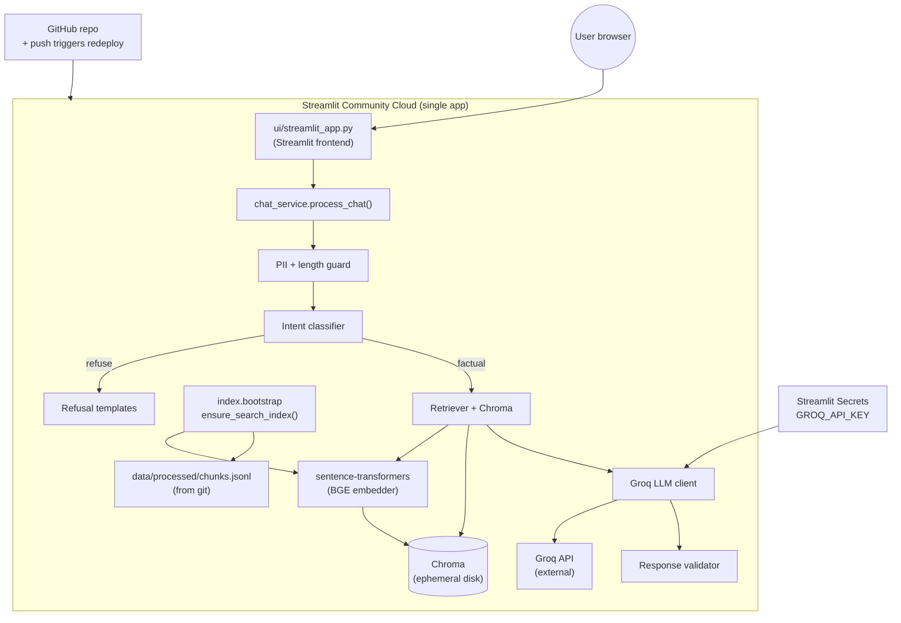
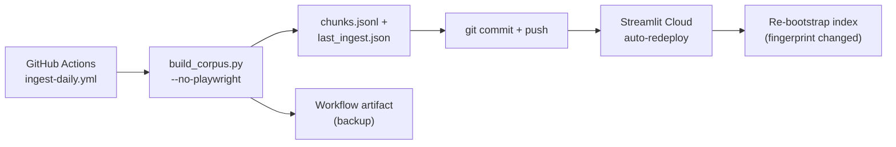

# Deployment Plan — Streamlit Community Cloud

This document describes how to deploy the **Mutual Fund FAQ Assistant** on [Streamlit Community Cloud](https://share.streamlit.io/) (streamlit.io). It covers both the **frontend** (Streamlit chat UI) and the **backend** (RAG pipeline: retrieval, safety, Groq generation).

---

## 1. Deployment target summary

| Layer | Component | Where it runs on Streamlit Cloud |
|-------|-----------|----------------------------------|
| **Frontend** | `ui/streamlit_app.py` | Streamlit Community Cloud app |
| **Backend (RAG)** | `src/api/chat_service.py` → guard → classifier → retriever → generator → validator | Same Streamlit process (in-process Python calls) |
| **Vector index** | Chroma (`data/chroma/`) | Built at runtime from `data/processed/chunks.jsonl` (not stored in git) |
| **Embeddings** | `BAAI/bge-small-en-v1.5` via sentence-transformers | Downloaded on first cold start; cached in the container |
| **LLM** | Groq (`llama-3.3-70b-versatile`) | External API; key via Streamlit Secrets |
| **REST API (optional)** | FastAPI `src/api/main.py` (`/api/chat`, `/api/health`) | **Not supported** as a separate service on Streamlit Cloud (see §3) |

**Recommended production shape:** one Streamlit Cloud app. The UI calls `process_chat()` directly — the same function used by `POST /api/chat` locally — so you do **not** need a separate API server for the chat product to work.

---

## 2. Architecture on Streamlit Cloud



### Cold-start sequence

1. Streamlit Cloud clones the repo and installs `requirements.txt`.
2. User opens the app → `_load_deploy_secrets()` maps Streamlit Secrets into `os.environ`.
3. `@st.cache_resource _prepare_search_index()` runs `ensure_search_index()`:
   - If Chroma is empty or missing NAV chunks → re-embed `data/processed/chunks.jsonl` (~1–2 minutes on first load).
   - If `chunks.jsonl` is missing → falls back to live Groww fetch (no Playwright on cloud; may be less reliable).
4. Subsequent requests reuse the cached index until the app reboots.

---

## 3. FastAPI REST API on streamlit.io

Streamlit Community Cloud runs **one Streamlit entrypoint per app**. It does **not** host standalone FastAPI/uvicorn services, and a second Streamlit app cannot bind to port 8000 for API traffic.

| Goal | Approach |
|------|----------|
| **Chat UI in production** | Deploy `ui/streamlit_app.py` on Streamlit Cloud (this plan) |
| **Programmatic `/api/chat` access** | Host `uvicorn src.api.main:app` on a separate platform (Render, Railway, Fly.io, Google Cloud Run, etc.) **or** use the Streamlit app only |
| **Local / Docker full stack** | `docker compose up` — API on `:8000`, UI on `:8501` (see root `README.md`) |

For a **streamlit.io-only** deployment, treat the FastAPI layer as a **local/dev/CI convenience**. Production users interact through the Streamlit frontend; the RAG backend is fully embedded.

If you later need a public REST API **and** keep the UI on Streamlit Cloud:

1. Deploy FastAPI elsewhere with the same repo, `GROQ_API_KEY`, and a persisted `data/chroma/` volume (or pre-built index artifact).
2. Optionally refactor the Streamlit UI to call `POST /api/chat` over HTTPS instead of `process_chat()` — not required today.

---

## 4. Prerequisites

### 4.1 Accounts and access

- [Streamlit Community Cloud](https://share.streamlit.io/) account (GitHub sign-in).
- GitHub repository with **admin** access (required to connect apps to private repos).
- [Groq](https://console.groq.com/) API key (free tier supported; see rate limits in `.env.example`).

### 4.2 Repository artifacts (must be in git)

| Path | In git? | Purpose |
|------|---------|---------|
| `data/processed/chunks.jsonl` | **Yes** | Source of truth for cloud index bootstrap |
| `data/urls.json` | **Yes** | Five Groww scheme URLs |
| `data/chroma/` | **No** (gitignored) | Rebuilt on each cold start |
| `data/raw/` | **No** (gitignored) | HTML snapshots; optional for cloud |
| `.env` | **No** | Use Streamlit Secrets instead |
| `requirements.txt` | **Yes** | Python dependencies |

Before first deploy, ensure chunks are built and committed:

```bash
python scripts/build_corpus.py --skip-fetch   # or full fetch
git add data/processed/chunks.jsonl
git commit -m "Add corpus chunks for Streamlit Cloud bootstrap"
git push
```

Verify locally:

```bash
streamlit run ui/streamlit_app.py
# Ask: "What is the minimum SIP for HDFC Large Cap Fund?"
```

### 4.3 Resource expectations

| Phase | Duration | Notes |
|-------|----------|-------|
| Dependency install | 2–5 min | `chromadb`, `sentence-transformers`, `torch` are heavy |
| First index bootstrap | 1–2 min | Embeds ~62 chunks; downloads BGE model (~130 MB) |
| Warm chat query | 2–8 s | Retrieval + Groq round-trip |
| App reboot | Re-bootstrap | Chroma on ephemeral disk is lost; index rebuilt from JSONL |

Community Cloud apps may **sleep** when idle; the next visitor triggers another cold start.

---

## 5. Step-by-step deployment

### Step 1 — Push code to GitHub

Ensure `main` (or your deploy branch) contains:

- `ui/streamlit_app.py`
- `requirements.txt`
- `data/processed/chunks.jsonl`
- `data/urls.json`
- `.streamlit/secrets.toml.example` (template only; never commit real secrets)

### Step 2 — Create the Streamlit Cloud app

1. Go to [share.streamlit.io](https://share.streamlit.io/) → **Create app**.
2. Select your GitHub repository and branch.
3. Set **Main file path** to:

   ```
   ui/streamlit_app.py
   ```

4. **App URL (slug):** choose a stable name, e.g. `mf-faq-assistant`.
5. **Python version:** `3.11` or `3.12` (match local dev; avoid end-of-life versions).
6. Click **Deploy**.

Streamlit Cloud installs dependencies from `requirements.txt` at the repository root.

### Step 3 — Configure secrets

In the app dashboard: **Settings → Secrets**. Minimum configuration:

```toml
GROQ_API_KEY = "gsk_xxxxxxxxxxxxxxxx"
```

Optional overrides (defaults are fine for most deploys):

```toml
GROQ_API_KEY = "gsk_xxxxxxxxxxxxxxxx"
LLM_MODEL = "llama-3.3-70b-versatile"
EMBEDDING_MODEL = "BAAI/bge-small-en-v1.5"
VECTOR_DB_PATH = "data/chroma"
TOP_K = "5"
SIMILARITY_THRESHOLD = "0.65"
LLM_TEMPERATURE = "0.1"
LLM_MAX_TOKENS = "256"
```

You may also nest keys under `[env]`; `ui/streamlit_app.py` reads both flat and nested forms.

**Save secrets** → Streamlit reboots the app automatically.

Local testing with the same format:

```bash
cp .streamlit/secrets.toml.example .streamlit/secrets.toml
# edit GROQ_API_KEY, then:
streamlit run ui/streamlit_app.py
```

### Step 4 — Optional: system packages

If the build fails compiling native extensions for Chroma or sentence-transformers, add a root-level `packages.txt`:

```
build-essential
```

Community Cloud runs `apt-get install` on Debian 11 for each line. The project Dockerfile already uses `build-essential` for the same reason.

### Step 5 — Wait for first bootstrap

Open the app URL. The first load shows:

> *Preparing search index (first load may take 1–2 minutes)…*

Monitor **Manage app → Logs** for:

- `Re-embedding N chunks from .../chunks.jsonl`
- `Rebuilt index: N vectors in collection 'hdfc_mf_corpus'`

If bootstrap fails, logs usually show a missing `chunks.jsonl`, embedding error, or absent `GROQ_API_KEY`.

### Step 6 — Post-deploy smoke test

Use the example buttons or ask:

| Query | Expected |
|-------|----------|
| Minimum SIP for HDFC Large Cap | Factual answer + Groww source link |
| Should I invest in mid cap? | Refusal (advisory) |
| Compare large cap vs small cap | Refusal (comparative) |
| What was last year's return? | Refusal / performance template |

Confirm the green disclaimer banner: **Facts-only. No investment advice.**

---

## 6. Corpus refresh in production

The vector index on Streamlit Cloud is **ephemeral**. What persists in git is `chunks.jsonl`. Refresh workflow:



### Automated daily refresh (recommended)

Workflow: `.github/workflows/ingest-daily.yml`

- Runs daily at **10:30 IST** (05:00 UTC) or via **workflow_dispatch**
- Re-fetches all five Groww pages and rebuilds the corpus
- **Commits and pushes** `data/processed/chunks.jsonl` and `data/processed/last_ingest.json` to `main`
- Streamlit Cloud redeploys on push; the app rebuilds Chroma from the new JSONL (fingerprint cache invalidation)
- Also uploads artifacts as backup (90-day retention)

`last_ingest.json` includes `nav_snapshots` — per-scheme NAV lines for the sidebar health panel.

> **Previous gap:** The workflow only uploaded artifacts. Streamlit Cloud reads from git, so NAV stayed stale until this auto-commit step was added.

### Manual refresh

```bash
python scripts/build_corpus.py          # re-fetch Groww pages
# or
python scripts/build_corpus.py --skip-fetch

git add data/processed/chunks.jsonl data/processed/last_ingest.json
git commit -m "Refresh corpus chunks"
git push
```

Then reboot the Streamlit app so `@st.cache_resource` re-runs bootstrap.

> **Note:** Pushing `chunks.jsonl` alone is sufficient. You do **not** need to upload `data/chroma/` to Streamlit Cloud.

---

## 7. Environment matrix

| Variable | Default | Streamlit Secret | Required |
|----------|---------|------------------|----------|
| `GROQ_API_KEY` | empty | Yes | **Yes** (for factual answers) |
| `LLM_MODEL` | `llama-3.3-70b-versatile` | Optional | No |
| `EMBEDDING_MODEL` | `BAAI/bge-small-en-v1.5` | Optional | No |
| `VECTOR_DB_PATH` | `./data/chroma` | Optional | No |
| `TOP_K` | `5` | Optional | No |
| `SIMILARITY_THRESHOLD` | `0.65` | Optional | No |
| `LLM_TEMPERATURE` | `0.1` | Optional | No |
| `LLM_MAX_TOKENS` | `256` | Optional | No |
| `LLM_CONTEXT_CHAR_BUDGET` | `6000` | Optional | No |
| `GROQ_MAX_RETRIES` | `3` | Optional | No |
| `GROQ_TIMEOUT_SEC` | `30` | Optional | No |

Secrets are loaded in `ui/streamlit_app.py` via `_load_deploy_secrets()` before `get_settings()` is used.

---

## 8. Operational checklist

### Pre-deploy

- [ ] `data/processed/chunks.jsonl` committed and non-empty
- [ ] `pytest` passes locally
- [ ] `streamlit run ui/streamlit_app.py` works with `.streamlit/secrets.toml`
- [ ] No secrets in git (`.env`, `.streamlit/secrets.toml` gitignored)
- [ ] `GROQ_API_KEY` set in Streamlit Secrets

### Deploy day

- [ ] App created with main file `ui/streamlit_app.py`
- [ ] Python 3.11+ selected
- [ ] First bootstrap completed (check logs)
- [ ] Smoke tests pass (factual + refusal queries)
- [ ] Disclaimer visible on every page load

### Ongoing

- [ ] Monitor Groq free-tier limits (30 req/min, 1K req/day on `llama-3.3-70b-versatile`)
- [ ] Refresh `chunks.jsonl` weekly or rely on daily GitHub Action + manual commit
- [ ] Reboot app after corpus or bootstrap code changes
- [ ] Review Streamlit logs after dependency upgrades

---

## 9. Troubleshooting

| Symptom | Likely cause | Fix |
|---------|--------------|-----|
| Build fails on `pip install` | Heavy deps / missing system libs | Add `packages.txt` with `build-essential`; pin Python 3.11 |
| "Could not prepare the search index" | Missing `chunks.jsonl` | Run `build_corpus.py`, commit JSONL, redeploy |
| "vector index is still empty" | Bootstrap exception swallowed | Check logs; verify JSONL has rows |
| "no NAV chunks" | Stale index or old JSONL | Rebuild corpus locally; push updated JSONL |
| All factual answers fail | Missing/invalid `GROQ_API_KEY` | Set secret; reboot app |
| Groq 429 errors | Free-tier rate limit | Retry later; reduce traffic; upgrade Groq plan |
| Very slow first load | Model download + embed | Expected; `@st.cache_resource` helps until reboot |
| Import errors for `src` | Wrong main file path | Main file must be `ui/streamlit_app.py` (sets `sys.path`) |
| Playwright / fetch fallback fails | Cloud has no browser | Always ship `chunks.jsonl`; do not rely on live fetch |

### Useful log lines

```
Re-embedding 62 chunks from .../data/processed/chunks.jsonl with BAAI/bge-small-en-v1.5...
Rebuilt index: 62 vectors in collection 'hdfc_mf_corpus'
```

### Health check without FastAPI

There is no `/api/health` on Streamlit Cloud unless you host FastAPI separately. Use:

- Streamlit app loads without error banner
- Example question returns an answer with a source link
- Expander **About this assistant** lists five schemes

---

## 10. Security and compliance

- **Secrets:** Store only in Streamlit Secrets; never commit `.env` or `secrets.toml`.
- **PII:** Input guard blocks PAN/Aadhaar patterns; no persistent chat storage (session only).
- **Disclaimer:** Fixed banner in UI; not a substitute for regulatory compliance in production.
- **Network:** Groq calls originate from Streamlit Cloud US IPs (see [Streamlit IP list](https://docs.streamlit.io/deploy/streamlit-community-cloud/status#ip-addresses) if whitelisting).
- **Repo visibility:** Public repos expose corpus text in `chunks.jsonl` (non-secret factual content from Groww pages).

---

## 11. Alternative: full stack (UI + REST API)

When you need **both** a public Streamlit UI **and** a public REST API:

| Service | Platform | Entry command |
|---------|----------|---------------|
| Frontend | Streamlit Cloud | `ui/streamlit_app.py` |
| Backend API | Render / Railway / Fly.io / Cloud Run | `uvicorn src.api.main:app --host 0.0.0.0 --port $PORT` |

API host requirements:

- Persist `data/chroma/` on a volume **or** run bootstrap on startup (same as Streamlit).
- Set `GROQ_API_KEY` and other env vars in the host's secret manager.
- CORS is already `allow_origins=["*"]` in `src/api/main.py` for browser clients.

This two-platform setup is the standard pattern when Streamlit Cloud is the frontend and FastAPI is the backend.

---

## 12. Quick reference

| Item | Value |
|------|-------|
| Deploy URL | `https://share.streamlit.io/` |
| Main file | `ui/streamlit_app.py` |
| Dependencies | `requirements.txt` (repo root) |
| Secrets template | `.streamlit/secrets.toml.example` |
| Bootstrap module | `src/index/bootstrap.py` |
| Shared chat logic | `src/api/chat_service.py` |
| Corpus commit path | `data/processed/chunks.jsonl` |
| Scheduled ingest | `.github/workflows/ingest-daily.yml` |

---

## 13. Related docs

- [Architecture.md](./Architecture.md) — system design
- [ImplementationPlan.md](./ImplementationPlan.md) — phase breakdown
- [QA_CHECKLIST.md](./QA_CHECKLIST.md) — manual sign-off before demo
- [README.md](../README.md) — local setup, Docker, evaluation

---

*Last updated: 2026-07-03. Target platform: Streamlit Community Cloud (streamlit.io).*
